<div align="center">

# ITSWEBER Mesh

**Self-hosted homelab dashboard** — services, widgets, server stats, smart-home and cameras in one place.
A modern Heimdall replacement built with Next.js 15, tRPC and Tailwind v4.

[](LICENSE)
[](#quick-start)
[](https://itsweber.de)

[Quick Start](#quick-start) · [Features](#features) · [Configuration](#configuration) · [Architecture](#architecture)

🇩🇪 **Auf Deutsch lesen** → [README.de.md](README.de.md)

</div>

---

## Screenshots

<details open>
<summary><strong>Dashboard</strong></summary>

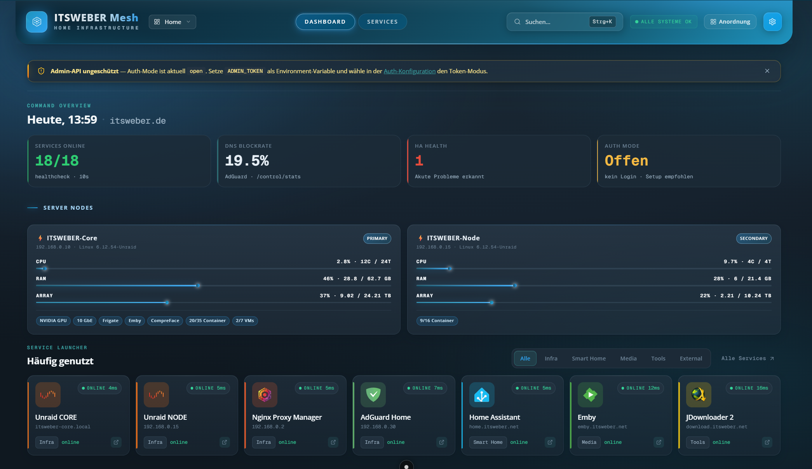
*Command overview, server nodes with live Glances data and pinned services with category filter.*

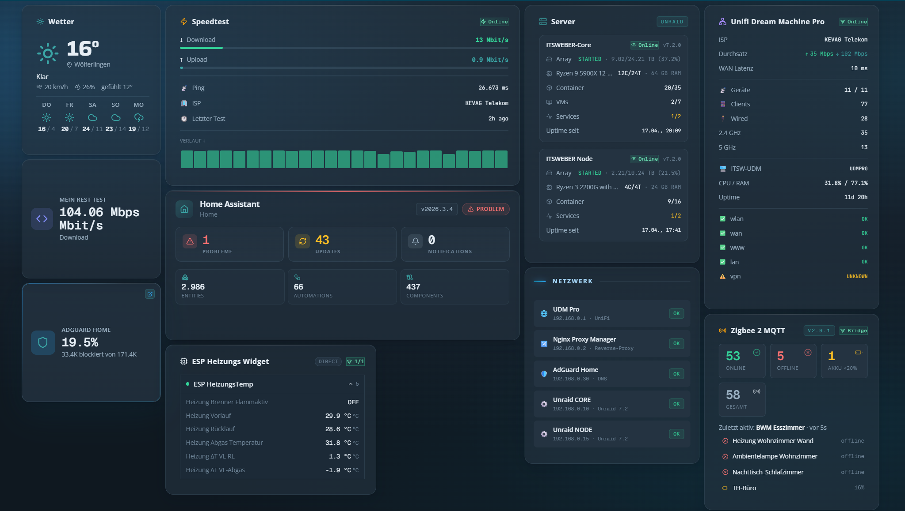
*Widget area — 19 kinds available, draggable on a 24×20 grid.*

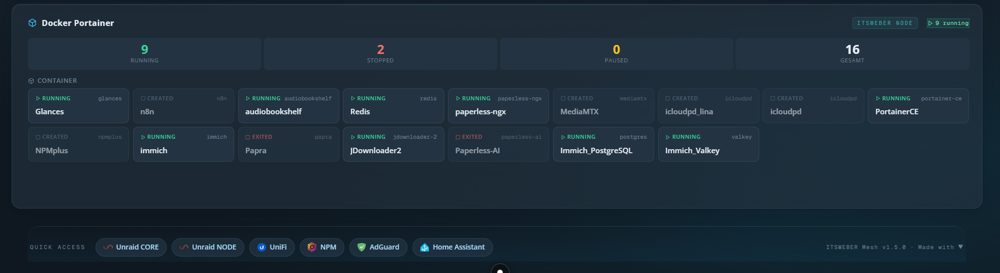
*Portainer widget — running, stopped, paused container counts plus per-container chips.*

</details>

<details>
<summary><strong>Services route</strong></summary>

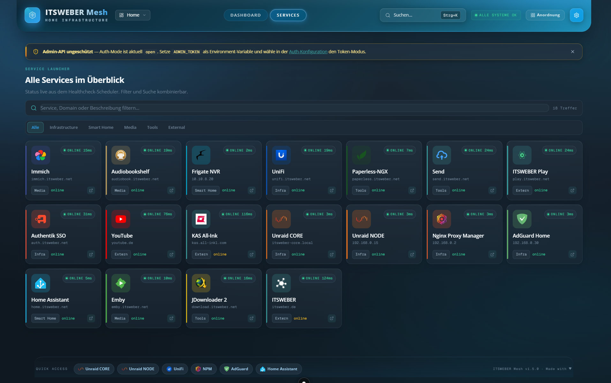
*All services in one place — search and category filter combine; status from the in-process healthcheck scheduler.*

</details>

<details>
<summary><strong>Cameras (UniFi Protect)</strong></summary>

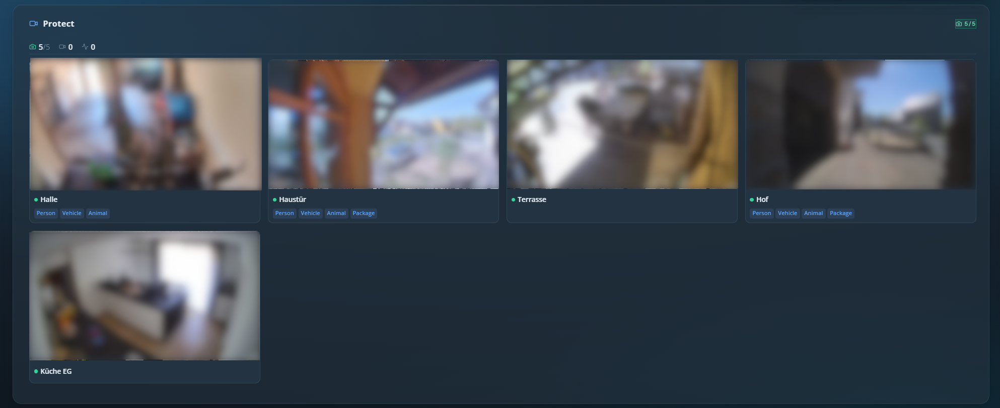
*UniFi Protect snapshot proxy — no RTSP juggling required.*

</details>

<details>
<summary><strong>Command palette</strong></summary>

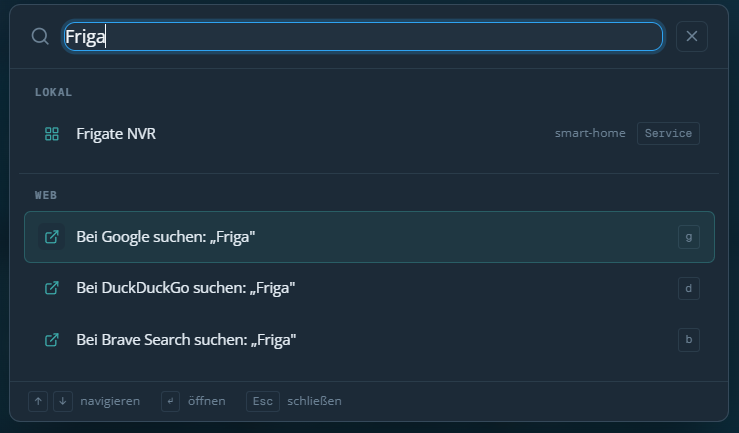
*Ctrl + K — local results (services, boards, quick-links, widgets) plus configurable web search engines.*

</details>

<details>
<summary><strong>Admin</strong></summary>

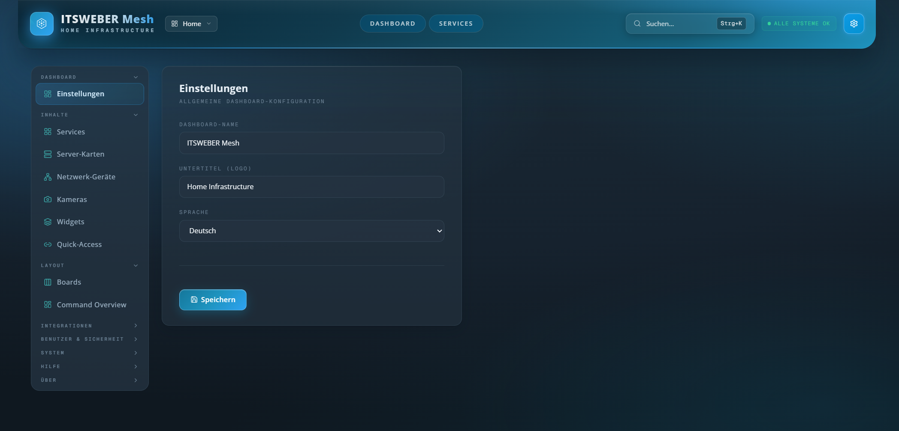
*Admin landing — name, locale, subtitle.*

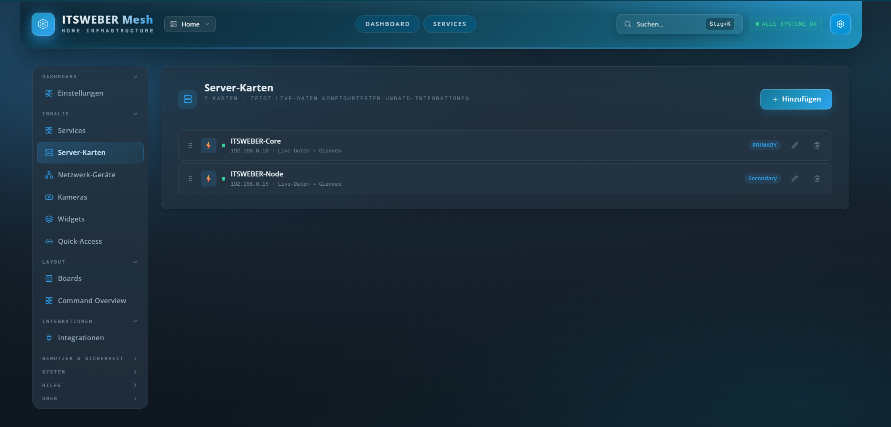
*Manage server cards on the dashboard. Each card binds to an Unraid + Glances instance.*

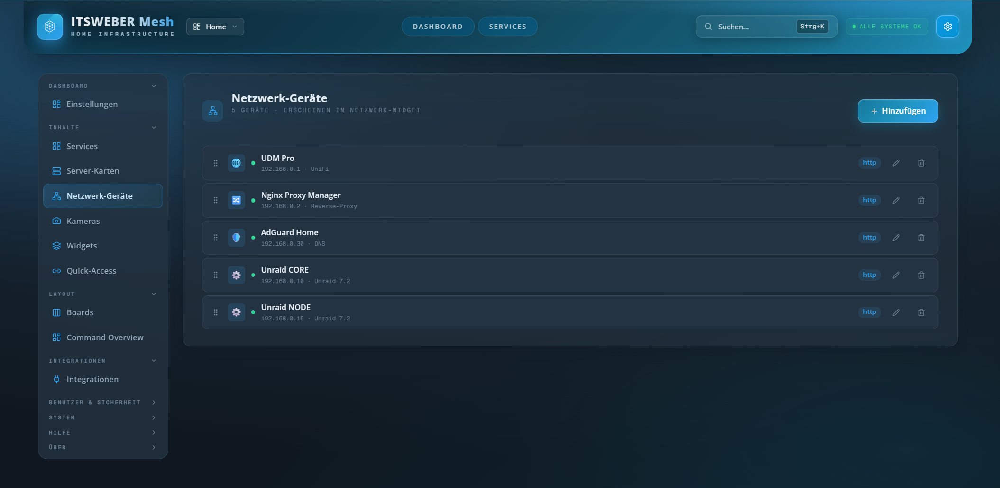
*Network devices with HTTP/TCP healthcheck — shown in the Network widget.*

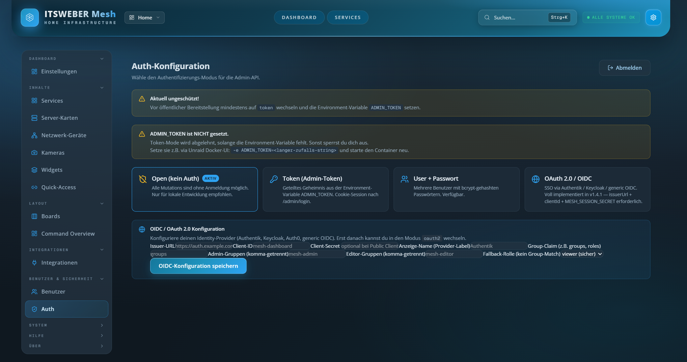
*Pluggable auth — open / token / user-password / OAuth2 (PKCE, JWKS).*

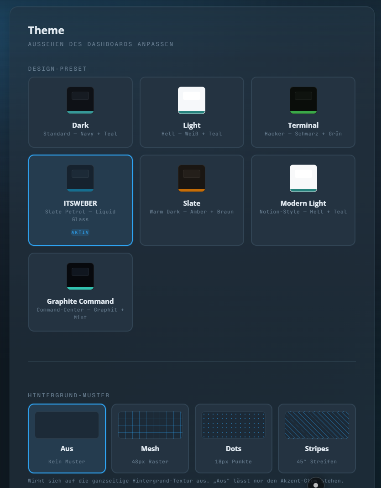
*7 built-in themes (Dark, Light, Terminal, ITSWEBER, Slate, Modern Light, Graphite Command).*

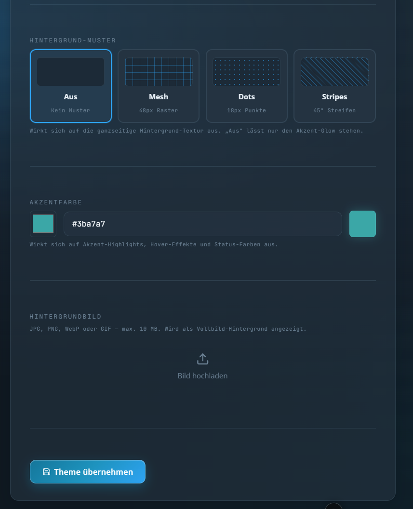
*Per-theme accent colour + background pattern + optional background image.*

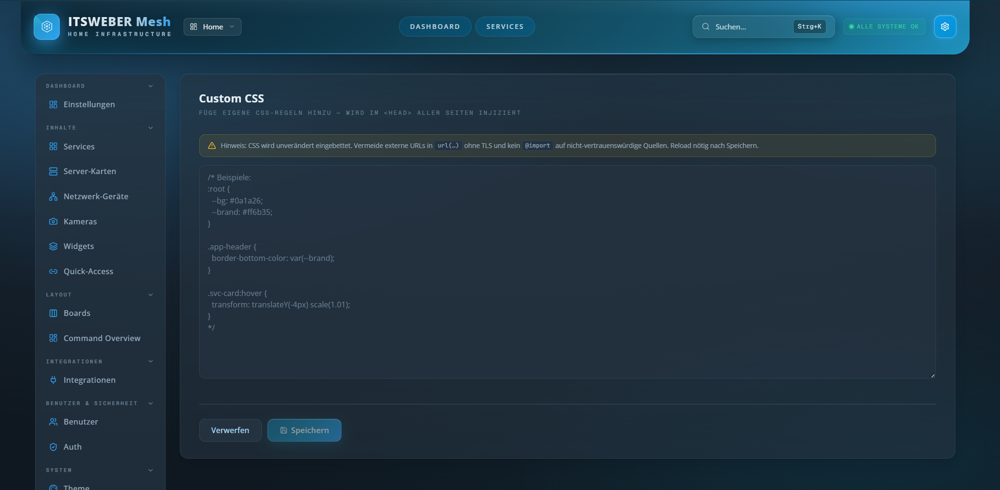
*Drop in custom CSS — applied live, no rebuild.*

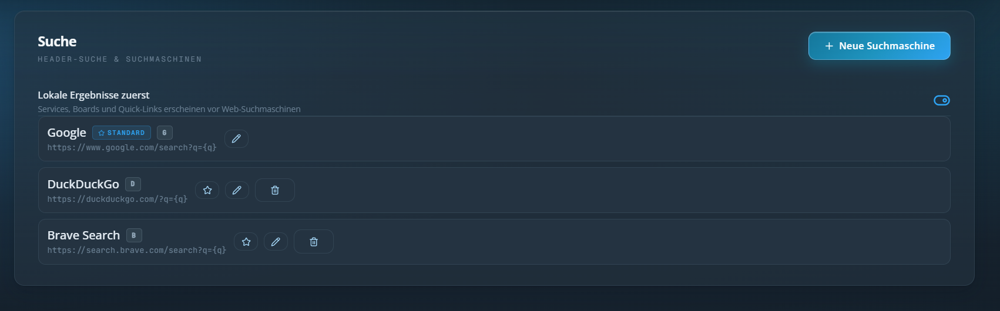
*Configure command-palette search engines.*

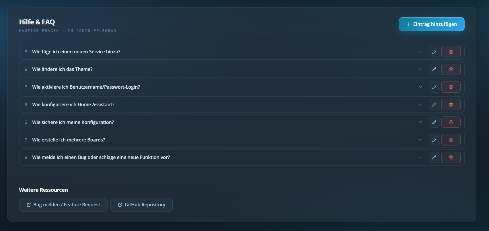
*Editable Help/FAQ — content lives in `config.json`, not in code.*

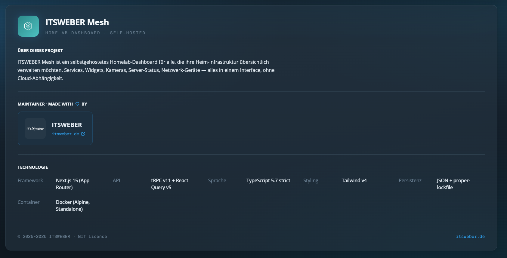
*Project identity, tech stack, copyright.*

</details>

## Features

- **Service launcher** with HTTP/TCP health checks (10 s scheduler), category filter, "pinned to home" section
- **Live server stats** via [Glances](https://nicolargo.github.io/glances/) — CPU / RAM / array / disk I/O / network
- **19 widget kinds** for Home Assistant, AdGuard, UniFi, Pi-hole, Speedtest, ESPHome, Zigbee2MQTT, Frigate, Portainer, Uptime Kuma, weather, custom REST and more
- **Multi-board support** — separate dashboards per room/topic, draggable layout via 24 × 20 react-grid-layout
- **Pluggable auth** — open / token / username-password / OAuth2 (PKCE, JWKS, group → role mapping)
- **Single Docker container**, Alpine-based, ~120 MB. Mount `/data` for config persistence
- **Theme system** — 7 built-in presets, custom CSS, brand-accent override
- **First-run wizard** + editable Help/FAQ + admin search
- **Command palette** (Ctrl + K) — local services + configurable web search engines
- **Healthcheck scheduler** in-process (`p-limit(8)`) — no external Cron needed
- **Glassmorphism UI**, mobile-responsive, no horizontal overflow

## Quick Start

### Docker (recommended)

```bash
# Generate a session secret (>= 32 chars; reuse on container replace!)
SESSION_SECRET=$(openssl rand -hex 32)

docker run -d \
  --name itsweber-mesh \
  --restart=unless-stopped \
  -p 3000:3000 \
  -e MESH_SESSION_SECRET="$SESSION_SECRET" \
  -v /your/path/itsweber-mesh:/data \
  ghcr.io/itsweber-official/itsweber-mesh:latest
```

> ⚠️ Keep the `MESH_SESSION_SECRET` stable across container restarts — otherwise
> all active OIDC sessions are invalidated.

Open http://localhost:3000 — the first-run wizard creates the admin user.

### docker-compose

```yaml
services:
  mesh:
    image: ghcr.io/itsweber-official/itsweber-mesh:latest
    container_name: itsweber-mesh
    restart: unless-stopped
    ports:
      - "3000:3000"
    environment:
      MESH_SESSION_SECRET: ${MESH_SESSION_SECRET}   # >= 32 chars
      DATA_DIR: /data
      PORT: "3000"
    volumes:
      - ./data:/data
      # Optional — only if you run on Unraid and want native Unraid stats:
      # - /var/run/unraid-api.sock:/var/run/unraid-api.sock:ro
```

### From source

```bash
git clone https://github.com/ITSWEBER-OFFICIAL/itsweber-mesh.git
cd itsweber-mesh
pnpm install
pnpm typecheck && pnpm test
pnpm dev          # http://localhost:3000
```

Build a Docker image yourself: `docker build -f docker/Dockerfile -t itsweber-mesh:dev .`

## Documentation

Step-by-step guides live in [`docs/guide/`](docs/guide/README.md):

- **Getting started** — [Quick Start](docs/guide/01-quick-start.md) ·
  [Docker installation](docs/guide/02-docker-installation.md) ·
  [Unraid installation](docs/guide/03-unraid-installation.md) ·
  [First-run wizard](docs/guide/04-first-run-wizard.md)
- **Concepts** — [Services vs. widgets](docs/guide/10-services-vs-widgets.md) ·
  [Boards](docs/guide/11-boards.md) · [Themes](docs/guide/12-themes.md) ·
  [Auth modes](docs/guide/13-auth-modes.md) ·
  [Healthchecks](docs/guide/14-healthchecks.md) ·
  [Command palette](docs/guide/15-search-command-palette.md)
- **Integrations** — [Overview](docs/guide/20-integrations-overview.md), then
  one page per integration (Home Assistant, Glances, AdGuard, Pi-hole, UniFi,
  UniFi Protect, Portainer, Frigate, ESPHome, Zigbee2MQTT, Uptime Kuma,
  Speedtest, weather, custom REST)
- **Operations** — [Backups & migrations](docs/guide/90-backups-migrations.md) ·
  [Troubleshooting](docs/guide/91-troubleshooting.md) ·
  [Architecture deep-dive](docs/guide/92-architecture.md)

## Configuration

### Environment variables

| Variable                | Default       | Notes |
|-------------------------|---------------|-------|
| `MESH_SESSION_SECRET`   | *(required)*  | Min. 32 chars, used to sign session cookies. **Reuse across restarts.** |
| `PORT`                  | `3000`        | HTTP port the Next.js server binds to |
| `DATA_DIR`              | `/data`       | Where `config.json` and backups live (mount as volume) |
| `NODE_OPTIONS`          | —             | e.g. `--max-old-space-size=512` for tight memory |

### Persisted configuration

All UI changes go into `${DATA_DIR}/config.json` (zod-validated, `proper-lockfile`,
schema migration chain). Before each schema bump a backup is created at
`${DATA_DIR}/config.json.pre-v{N}` — never overwrites existing backups.

### Integrations supported out of the box

Home Assistant · AdGuard Home · UniFi Network + Protect · Pi-hole · Glances ·
Portainer · Uptime Kuma · Speedtest-Tracker · Frigate · ESPHome · Zigbee2MQTT
(via HA template auto-discovery) · OpenWeatherMap · Custom REST (any JSONPath).

Each integration is configured in **Admin → Integrations** — no `.env` file
gymnastics, no YAML.

## Architecture

| Layer            | Technology                                          |
|------------------|-----------------------------------------------------|
| Framework        | Next.js 15 (App Router, React 19), monolithic       |
| RPC              | tRPC v11 + React Query v5 + superjson               |
| Language         | TypeScript 5.7 strict, `exactOptionalPropertyTypes` |
| Package manager  | pnpm 9.15 + Turborepo                               |
| Styling          | Tailwind v4, CSS variables per theme                |
| Forms            | react-hook-form + Zod                               |
| Modal/dialog     | Radix UI Dialog (no in-house modal)                 |
| Persistence      | JSON `/data/config.json` + Zod + `proper-lockfile` + migration chain |
| Logging          | pino (JSON, stdout)                                 |
| Container        | `node:22-alpine`, multi-stage, Standalone-Output    |

Detailed architecture: [`docs/ARCHITECTURE.md`](docs/ARCHITECTURE.md) ·
Roadmap: [`docs/ROADMAP.md`](docs/ROADMAP.md) ·
Changelog: [`CHANGELOG.md`](CHANGELOG.md).

## Development

```bash
pnpm dev              # Next.js dev server with HMR
pnpm typecheck        # tsc --noEmit
pnpm test       # vitest (42+ tests)
pnpm build            # production build (Standalone)
pnpm lint             # ESLint
```

The codebase enforces:

- **No private data in core** — anything user-specific belongs in `/data/config.json`
- **Strict TypeScript** — `exactOptionalPropertyTypes`, `noUncheckedIndexedAccess`
- **Modal builds use Radix Dialog** — never roll your own
- **Schema bumps require migrations** — see `apps/web/src/server/config/migrations.ts`

## Roadmap

- [x] v1.x — feature-complete dashboard with 19 widget kinds and 11 integrations
- [x] v1.4.7 — ESPHome v3 SSE streaming, Zigbee2MQTT auto-discovery
- [x] **v1.5.1** — Route-based navigation (`/`, `/services`, `/admin`),
      pinned-to-home services, ITSWEBER theme polish, first public release
- [ ] v1.6 — Glances enrichments (load avg, disk I/O, GPU temps as InfraNode chips)
- [ ] v1.7 — Direct MQTT for Zigbee2MQTT (no HA proxy needed)
- [ ] v2.0 — OAuth2/Authentik production hardening, Unraid Community App listing

## Contributing

See [CONTRIBUTING.md](CONTRIBUTING.md). Issues, feature requests and PRs welcome.

## Security

See [SECURITY.md](SECURITY.md) for responsible disclosure policy.

## License

[AGPL-3.0](LICENSE) — Copyright © 2026 ITSWEBER.

If you run a modified version as a network service, you must publish your
modifications under the same license (AGPL §13). Self-hosting for personal
or internal use is unaffected.

## Maintainer

Built by **[ITSWEBER](https://itsweber.de)**.
